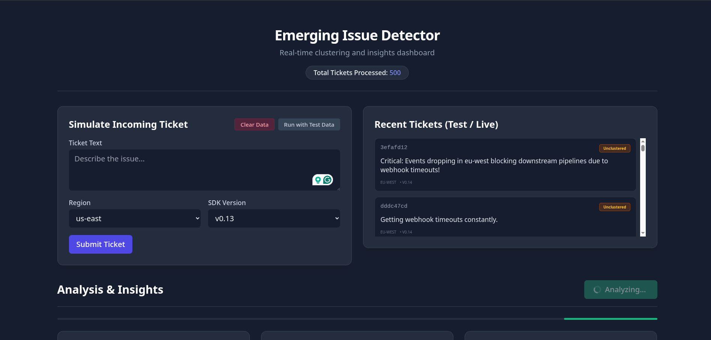
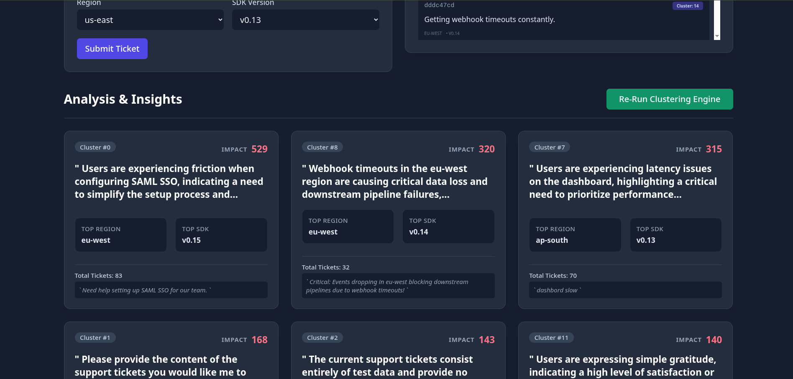
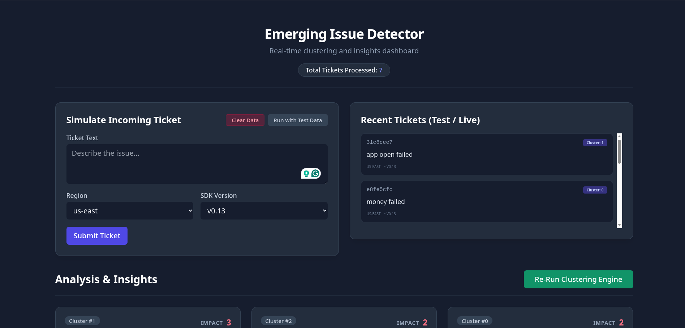
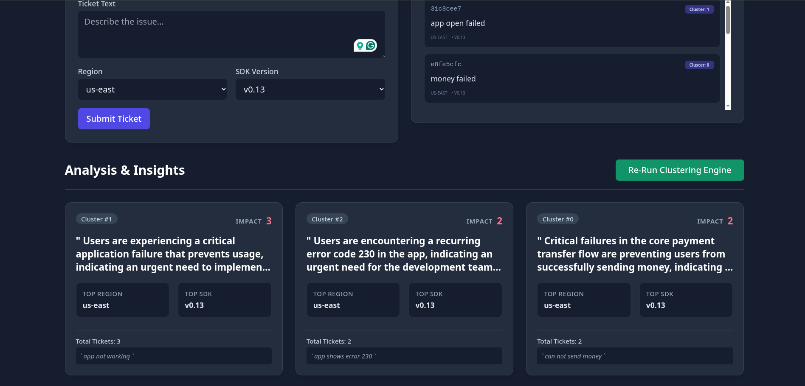

# Emerging Issue Detector

A application designed to ingest support tickets, generate semantic embeddings, and cluster them organically to surface high-impact product issues in real-time.

## Quickstart

I've bundled everything into a simple Makefile to ensure effortless local setup.

**Prerequisites:** Python 3.11+

```bash
# 1. Install dependencies
make install

# 2. Export your Gemini API key for AI summaries
export GEMINI_API_KEY="your_api_key_here"

# 3. Start the FastAPI server locally
make run
```

Once running, the server will be available at `http://localhost:8000`. 
**Go directly to [http://localhost:8000](http://localhost:8000) to see the sleek Emerging Issue Detector UI in action!** 

*(You can also view the auto-generated API docs at `http://localhost:8000/docs`).*

## Core Endpoints

- `GET /`: Loads the Frontend UI.
- `POST /ingest`: Accepts support tickets, generates vectors locally via `sentence-transformers`, and stores them.
- `POST /analyze`: Triggers the HDBSCAN clustering engine across unclustered items.
- `GET /insights`: Calls the LLM to generate human-readable summaries of trending issues and returns them securely.
- `POST /seed` & `POST /clear`: Fast sandboxing tools.

## Architecture Summary

Built for maintainability, speed, and zero external infrastructure dependencies:

- **API Framework**: FastAPI for routing and serving static HTML dynamically.
- **Embeddings**: `sentence-transformers` (`all-MiniLM-L6-v2`) running locally in-memory to avoid API latency.
- **Clustering**: `hdbscan` for density-based semantic clustering, gracefully tuned for small & large payloads.
- **LLM Summarization**: Google Gemini strictly for summarizing clusters into human-readable insights.
- **Durability**: Standard `sqlite3`. Directly serializes NumPy arrays to BLOB columns to avoid ORMs and vector-db footprint.

## Sample API Output: `/insights`

The core engine surfaces high-level trends with calculated enterprise impact scores alongside actionable intelligence.

```json
{
  "clusters": [
    {
      "cluster_id": 0,
      "size": 42,
      "impact_score": 140,
      "metadata": {
        "top_sdk_version": "v0.14",
        "top_region": "eu-west"
      },
      "summary": "Users in the EU region are experiencing missing webhook timeouts blocking pipelines.",
      "samples": [
        "Critical: Events dropping in eu-west blocking downstream pipelines due to webhook timeouts!",
        "Getting webhook timeouts constantly."
      ]
    }
  ]
}
```

## Bonus Features

*   **Sleek Frontend Dashboard:** Added a dark-themed, single-page UI built with Tailwind CSS. It features a live ticket feed, a manual ingestion form, animated progress bars, and beautifully rendered cluster insight cards.
*   **LLM Rate-Limit Bypassing:** Integrated Python's `@lru_cache` to seamlessly tackle Google Gemini's free-tier API rate limits. Identical cluster summaries are instantly grabbed from memory, preventing massive API blocks.
*   **Small Dataset Resilience:** HDBSCAN usually struggles with tiny test environments (throwing everything into `-1` noise). I've rewritten the algorithm to dynamically scale down `min_cluster_size` and relaxed `min_samples` thresholds. Now, it intelligently groups small manual ticket submissions together!
*   **Dev-Friendly Sandboxing:** Added a quick **Seed Data** and **Clear Data** button straight to the UI—and API backend—so you can quickly nuke your environment and repopulate synthetic mock data to test the clustering engine instantly.

## Screenshots





