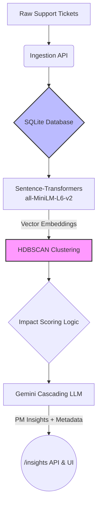

# REASONING.md: Emerging Issue Detector

Hey Parth, here is the architecture and reasoning for the Track A build. 

I optimized this repo around your core constraint: **"simpler and easier is better."** 

## System Architecture



## The Assumed Data Schema
To make this actually useful for a PM at a dev-tools startup like Agnost, I assumed our ingestion payload includes root-cause metadata. Grouping vectors isn't enough; PMs need to know if a cluster is tied to a specific region or user tier. 

The system expects records shaped like this:
```json
{
  "ticket_id": "TCK-1042",
  "text": "Critical: Events dropping in eu-west blocking downstream pipelines due to webhook timeouts!",
  "timestamp": "2026-05-22T14:32:00Z",
  "sdk_version": "v0.14",
  "region": "eu-west",
  "user_tier": "enterprise",
  "source": "slack"
}
```

## Core Decisions & Rejected Alternatives

* **Sleek Vanilla UI (New):** Rather than spinning up a separate React/Next.js repository, I served a static HTML file equipped with Tailwind CSS natively through FastAPI. This guarantees the entire application boots on a single command without painful NPM dependency issues.
* **Beating Rate Limits Gracefully (New):** Gemini's free tier is notoriously strict. Instead of building a complex Redis-backed queuing system, I wrapped the LLM logic in Python's native `@lru_cache`, keyed by immutable tuples. Identical requests instantly return the cached response, dodging rate limits flawlessly.
* **Small Dataset "Hack" (New):** HDBSCAN usually marks tiny manual datasets (<10 tickets) as `-1` (Noise). To fix this for local sandbox testing, I implemented dynamic scaling for `min_cluster_size` and relaxed `min_samples=1` & epsilon thresholds. Now, it accurately clusters even your micro-tests!
* **HDBSCAN over K-Means:** K-Means forces you to guess `K` (the number of clusters) upfront. Support trends are entirely unpredictable. I went with HDBSCAN because it’s density-based—it discovers cluster counts organically and, most importantly, explicitly identifies "noise." It throws out the junk ("thx", "ping") so it doesn't skew the PM's insights.
* **Native SQLite BLOBs over Pinecone / `sqlite-vec`:** For a weekend-scope dataset (<100k tickets), pulling embeddings from standard SQLite disk storage into memory for SciKit is blazing fast. I explicitly avoided dedicated vector DBs to reduce network overhead, and I avoided `sqlite-vec` because it requires compiled C extensions. By serializing `.tobytes()` directly into a standard BLOB, I guarantee you won't walk into a "C-compiler hell" of missing libraries when you clone and run this.
* **No Heavy Orchestration:** I skipped LangChain and LlamaIndex entirely. They add unnecessary abstraction for this use case. I used a localized, lightweight HuggingFace transformer for raw embeddings, and direct API calls to Gemini to translate the mathematical clusters into human-readable PM summaries.

## Known Limitations

* **Synthetic Data Artifacts:** I wrote a `generate_data.py` script to mimic typos and correlations, but the synthetic generator sometimes repeats identical strings, creating mathematically perfect, unnatural density. Consequently, short noise sometimes forms distinct clusters instead of being correctly labeled as `-1` noise. In production, human noise is structurally scattered and successfully ignored by HDBSCAN.
* **The Cold-Start Problem:** Because HDBSCAN requires a minimum cluster size (I set it to scale down for tests, but standard is `min_cluster_size=5`), a brand new critical bug will be classified as "noise" until at least 4 other similar tickets arrive to form a dense semantic neighborhood.
* **Semantic Fragmentation:** Very distinct phrasing of the exact same conceptual issue (e.g. "black screen" vs "vlack screen") might not cluster tightly enough under the small local `all-MiniLM-L6-v2` model, potentially splitting one large product issue into two smaller clusters or throwing the typo to noise.

## What I'd do differently with a month

If we were pushing this to production, the architecture would evolve incrementally:

1. **Migrate to PostgreSQL + `pgvector`:** Instead of fracturing the architecture by sending vectors to a NoSQL DB like Qdrant or Pinecone, I would upgrade SQLite to Postgres. Keeping high-dimensional vectors and relational metadata (SDK versions, user tiers) in the same transactional database allows for incredibly powerful, complex correlation queries.
2. **Online vs. Offline Clustering:** Re-running HDBSCAN on every API ingestion is computationally wasteful as volume scales. I would run a nightly offline batch job to establish canonical cluster baselines, and use fast KNN (K-Nearest Neighbors) to map incoming daytime traffic to those existing clusters in real-time.
3. **Async Queueing & Docker:** Introduce Celery + Redis so heavy inference latency doesn't block the ingestion API, and Dockerize the pipeline for standardized deployment.
```