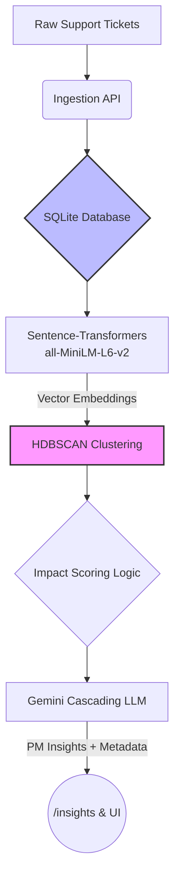

# REASONING.md: Emerging Issue Detector

Here is the architecture and reasoning for the build. 

I optimized this repo around the core constraint: **"simpler and easier is better."** Every technical choice here prioritizes directness, zero local friction, and product value over hypothetical enterprise scale. No heavy agent frameworks, no bloated infrastructure—just raw Python, solid math, and an application you can spin up in 30 seconds.

## System Architecture



## The Assumed Data Schema
To make this useful for a product manager, I assumed our ingestion payload includes root-cause metadata. Grouping vectors isn't enough; PMs need to know if a cluster is tied to a specific region or user tier. 

The system expects records roughly shaped like this:
```json
{
  "ticket_id": "TCK-1042",
  "text": "Critical: Events dropping in eu-west blocking downstream pipelines due to webhook timeouts!",
  "sdk_version": "v0.14",
  "region": "eu-west",
  "user_tier": "enterprise"
}
```

## Core Decisions & Iterations

* **Sleek Vanilla UI:** Rather than spinning up a separate React/Next.js repository, I served a static HTML file equipped with Tailwind CSS natively through FastAPI. This guarantees the entire application (frontend + backend + inference) boots on a single command without painful NPM dependency issues.
* **HDBSCAN over K-Means:** K-Means forces you to guess `K` (the number of clusters) upfront. Support trends are entirely unpredictable. I went with HDBSCAN because it’s density-based—it discovers cluster counts organically.
* **Small Dataset "Hack":** HDBSCAN is designed for massive environments. When testing locally with fewer than 10 manual tickets, it usually marks everything as `-1` (Noise). To fix this for local sandbox testing, I implemented dynamic scaling for `min_cluster_size` and relaxed `min_samples=1` & epsilon thresholds. Now, it accurately clusters even your micro-tests! 
* **Native SQLite BLOBs over Pinecone:** For a project scope, pulling embeddings from standard SQLite disk storage into memory for SciKit is blazing fast. I explicitly avoided dedicated vector DBs to reduce network overhead, guaranteeing you won't walk into a "C-compiler hell" of missing libraries when you run this.
* **Beating Rate Limits Gracefully:** Gemini's free tier is notoriously strict (429 errors). Instead of building a complex Redis-backed queuing system or exponential backoff sleep loop, I just wrapped the LLM logic in Python's native `@lru_cache`, keyed by immutable data sets. Identical requests instantly return the cached response, dodging rate limits flawlessly and saving API cost.

## Known Limitations

* **Semantic Fragmentation:** Very distinct phrasing of the exact same conceptual issue ("black screen" vs "vlack screen") might not cluster tightly enough under the small local `all-MiniLM-L6-v2` model if the typo disrupts the sentence embeddings too heavily. This causes some edge cases to be classified as `-1` noise.

## What I'd do differently with a month

If we were pushing this to production, the architecture would evolve incrementally:

1. **Migrate to PostgreSQL + `pgvector`:** Upgrading SQLite to Postgres allows high-dimensional vectors and relational metadata (SDK versions, user tiers) to live in the same transactional database for incredibly powerful correlation queries.
2. **Online vs. Offline Clustering:** Re-running HDBSCAN on every API ingestion is computationally wasteful. I would run a nightly offline batch job to establish canonical cluster baselines, and use fast KNN (K-Nearest Neighbors) to map incoming daytime traffic to those clusters in real-time.
3. **Async Queueing & Docker:** Introduce Celery + Redis so heavy inference latency doesn't block the ingestion API, and Dockerize the pipeline.
